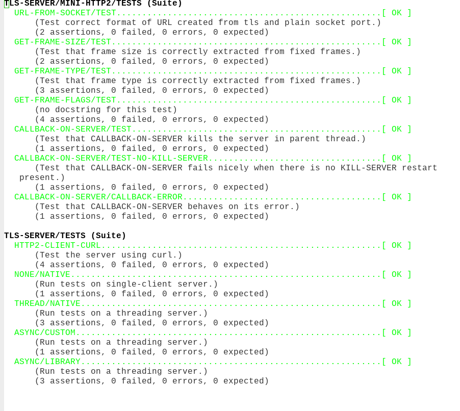

# Overview

## Table of Contents

- [1 Implementations][335b]
- [2 Bugs and considered improvements][2da8]

###### \[in package TLS-SERVER\]
I wanted to play with different options for HTTP/2 server implementations. While
I have a more correct implementation of HTTP/2, I wanted something simple to
test different client handling options, as well as speed limits and impact of
different choices.

So this repository implements:

- very simplified (and indeed incorrect in more than few ways) server side of HTTP/2 protocol, and based of that

- several versions of TCP server that accept and handle the request.

All the server implementations can be started with [`CREATE-SERVER`][dd5c]. New server
types with same interface are defined by specializing [`DO-NEW-CONNECTION`][2ab2]

See also (additional documentation)\[https://docs.zellerin.cz/tls-server-poc\] for
details of the implementations.

- [function] **CREATE-SERVER** *PORT TLS DISPATCH-METHOD &KEY (HOST "127.0.0.1") (ANNOUNCE-URL-CALLBACK (CONSTANTLY NIL))*

    Create a server on `HOST` and `PORT` that handles connections (possibly with `TLS`) using
    `DISPATCH-METHOD`.
    
    `ANNOUNCE-URL-CALLBACK` is called when server is set up on the TCP level and
    receives one parameter, `URL` that server listens on. The idea is to be able to connect
    to server when `PORT` is 0, that is, random port.
    
    Establishes restart `KILL-SERVER` to close the TCP connection and return.
    
    Calls [`DO-NEW-CONNECTION`][2ab2] to actually handle the connections after the callback
    returns This function also receives the listening socket ad `TLS` and
    `DISPATCH-METHOD` as parameters.

- [generic-function] **DO-NEW-CONNECTION** *LISTENING-SOCKET TLS DISPATCH-METHOD*

    This method is implemented for the separate connection types. It waits on
    new (possibly tls) connection to the `LISTENING-SOCKET` and start handling it
    using `DISPATCH-METHOD`.
    
    See [Implementations][335b] for available `DISPATCH-METHOD`.
    
    `TLS` is either `NIL` or `:TLS`. Note that when using HTTP/2 without `TLS`, most clients have to be instructed to
    use tls - e.g., --http2-prior-knowledge for curl.

## 1 Implementations

Following implementations are defined:

- [method] **DO-NEW-CONNECTION** *LISTENING-SOCKET TLS (DISPATCH-METHOD (EQL :NONE))*

    Handle the connection while doing nothing else.
    
    Serve just one client at time: when it connects, read the incoming requests and
    handle them as they arrive. When the client sends go-away frame, close the
    connection and be ready to serve another client.
    
    Obviously, there is little overhead and this version is actually pretty fast -
    for one client and in ideal conditions (especially with request pilelining).

- [method] **DO-NEW-CONNECTION** *LISTENING-SOCKET TLS (DISPATCH-METHOD (EQL :THREAD))*

    Handle the connection in a new dedicated thread. This is a method that is used,
    e.g., by Hunchentoot.

- [method] **DO-NEW-CONNECTION** *LISTENING-SOCKET TLS (DISPATCH-METHOD (EQL :NONE/HTTP2))*

    Handle the connection while doing nothing else using HTTP2 asdf library for
    actual work. Otherwise it is same as the `:NONE` method (i.e., serving a single
    client at time).

- [method] **DO-NEW-CONNECTION** *SOCKET (TLS (EQL NIL)) (DISPATCH-METHOD (EQL :ASYNC))*

    Handle new connections using cl-async event loop.
    
    Pros: This version can be run in one thread and process many clients.
    
    Cons: requires a specific C library, and the implementation as-is depends on
    SBCL internal function - we re-use the file descriptor of socket created by
    usocket package, as otherwise access to the port of server is complicated.

- [method] **DO-NEW-CONNECTION** *SOCKET (TLS (EQL T)) (DISPATCH-METHOD (EQL :ASYNC))*

    Handle new connections using cl-async event loop.
    
    Pros: This version can be run in one thread and process many clients.
    
    Cons: requires a specific C library, and the implementation as-is depends on
    SBCL internal function - we re-use the file descriptor of socket created by
    usocket package, as otherwise access to the port of server is complicated.

- [method] **DO-NEW-CONNECTION** *SOCKET (TLS (EQL :NONBLOCK)) (DISPATCH-METHOD (EQL :ASYNC))*

    Handle new connections using cl-async event loop.
    
    Pros: This version can be run in one thread and process many clients.
    
    Cons: requires a specific C library, and the implementation as-is depends on
    SBCL internal function - we re-use the file descriptor of socket created by
    usocket package, as otherwise access to the port of server is complicated.

- [method] **DO-NEW-CONNECTION** *SOCKET (TLS (EQL :TLS)) (DISPATCH-METHOD (EQL :ASYNC-CUSTOM))*

    Handle new connections using TLS-SERVE above.

## 2 Bugs and considered improvements

Test in another implementation

Improve backpressure

See TODO: and FIXME: in the code

Add measurement points and tunables (probably using (clip)\[https://github.zellerin.cz/clip-1.4\]

Do some measurements for real clients and specific cases

Add test cases and name existing ones better. Maybe there is a room for
a (better process)\[https://doc.zellerin.cz/Integrate%20test%20framework.html\]

 

Try Quic/HTTP3

  [2ab2]: #x-28TLS-SERVER-3ADO-NEW-CONNECTION-20GENERIC-FUNCTION-29 "TLS-SERVER:DO-NEW-CONNECTION GENERIC-FUNCTION"
  [2da8]: #x-28TLS-SERVER-3A-40TODOS-20MGL-PAX-3ASECTION-29 "Bugs and considered improvements"
  [335b]: #x-28TLS-SERVER-3A-40IMPLEMENTATIONS-20MGL-PAX-3ASECTION-29 "Implementations"
  [dd5c]: #x-28TLS-SERVER-3ACREATE-SERVER-20FUNCTION-29 "TLS-SERVER:CREATE-SERVER FUNCTION"

* * *
###### \[generated by [MGL-PAX](https://github.com/melisgl/mgl-pax)\]
