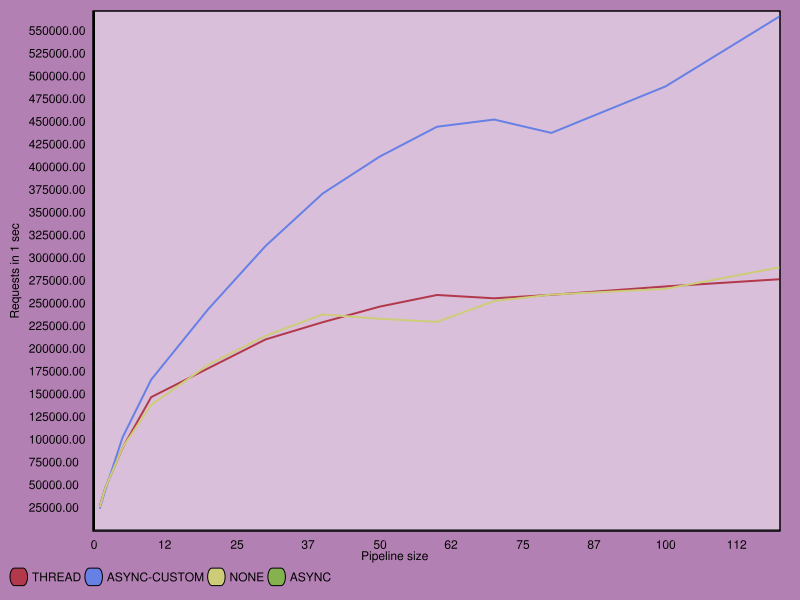
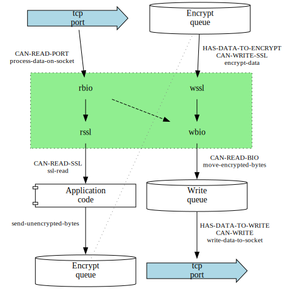

# Experiments with HTTP/2 server

*Note*: This project was primarily a pilot to test how to integrate poll server
into [http2 server](https://github.com/zellerin/http2). Now this is integrated,
which makes this repo obsolete.

## Table of Contents

- [1 Generic server interface][661c]
- [2 Implementations][335b]
- [3 Work with octets][4bea]
- [4 HTTP/2 protocol.][2907]
    - [4.1 Prebuild frames][c5b5]
    - [4.2 Header parsing][b190]
    - [4.3 Error conditions][98e8]
- [5 `TLS` with CL+SSL][bbf1]
- [6 Synchronous implementations][2b8e]
- [7 Server built using HTTP2 package.][0bd6]
- [8 CL-ASYNC based implementation (asynchronous)][2c80]
- [9 Asynchronous `TLS` server][1665]
    - [9.1 Client actions loop][c0ae]
    - [9.2 HTTP2 handling][d37a]
- [10 New locatives][cb85]
- [11 Packages][d1d3]
- [12 Experiments][300a]
    - [12.1 Clips][8595]

###### \[in package TLS-SERVER\]
I wanted to play with different options for HTTP/2 server implementations. While
I have a more correct implementation of HTTP/2, I wanted something simple to
test different client handling options, as well as speed limits and impact of
different choices.

So this repository implements:

- very simplified (and indeed incorrect in more than few ways) server side of
  HTTP/2 protocol, and based of that

- several versions of TCP server that accept and handle the request.

Presently, the most advanced is the async version that uses CFFI

## 1 Generic server interface

The functions below implement server creation on an abstract level. Individual
server types implement appropriate methods to ensure desired behaviour.

- [function] **CREATE-SERVER** *PORT TLS DISPATCH-METHOD &REST KEYS &KEY (HOST "127.0.0.1") (ANNOUNCE-URL-CALLBACK (CONSTANTLY NIL)) &ALLOW-OTHER-KEYS*

    Create a server on `HOST` and `PORT` that handles connections (possibly with `TLS`) using
    `DISPATCH-METHOD`.

    `ANNOUNCE-URL-CALLBACK` is called when server is set up on the TCP level and
    receives one parameter, `URL` that server listens on. The idea is to be able to connect
    to server when `PORT` is 0, that is, random port.

    Establishes restart [`KILL-SERVER`][23e3] to close the TCP connection and return.

    Calls [`DO-NEW-CONNECTION`][2ab2] to actually handle the connections after the callback
    returns This function also receives the listening socket ad `TLS` and
    `DISPATCH-METHOD` as parameters.

- [generic-function] **DO-NEW-CONNECTION** *LISTENING-SOCKET TLS DISPATCH-METHOD &KEY ((:NAGLE TLS-SERVER/ASYNC/TLS::\*NAGLE\*))*

    This method is implemented for the separate connection types. It waits on
    new (possibly tls) connection to the `LISTENING-SOCKET` and start handling it
    using `DISPATCH-METHOD`.

    See [Implementations][335b] for available `DISPATCH-METHOD`.

    `TLS` is either `NIL` or `:TLS`. Note that when using HTTP/2 without `TLS`, most clients
    have to be instructed to use tls - e.g., --http2-prior-knowledge for curl.

    Raise `UNSUPPORTED-SERVER-SETUP` if there is no relevant method.

- [restart] **KILL-SERVER** *&OPTIONAL VALUE*

    Restart established in [`CREATE-SERVER`][dd5c] that can be invoked to terminate the server
    properly and return `VALUE`.

- [function] **KILL-SERVER** *&OPTIONAL RESULT*

    Kill server by invoking [`KILL-SERVER`][23e3] restart, if it exists.

- [restart] **KILL-PARENT** *&OPTIONAL VALUE*

    Restart established in [`CREATE-SERVER`][dd5c] that TODO

- [restart] **GO-AWAY** *&OPTIONAL VALUE*

    Handler to be invoked to close HTTP connection from our side.

    It is established either in [`TLS-SERVER/SYNCHRONOUS:DO-CONNECTION`][3f72].

    TODO: Should we have it in async-cffi loop as well?

- [function] **CALLBACK-ON-SERVER** *FN &KEY (THREAD-NAME "Test client for a server")*

    Return a function that takes one parameter, `URL`, as a parameter and calls `FN` on
    it in a separate thread. Then it kills the server by invoking [`KILL-SERVER`][23e3] restart.

    This is to be used as callback on an open server for testing it.

- [function] **URL-FROM-SOCKET** *SOCKET HOST TLS*

    Return `URL` that combines `HOST` with the port of the `SOCKET`.

    This is to be used as callback fn on an open server for testing it.

- [function] **URL-FROM-PORT** *PORT HOST TLS*

    Return `URL` that combines `HOST` with the port of the `SOCKET`.

    This is to be used as callback fn on an open server for testing it.

- [variable] **\*BUFFER\*** *NIL*

    Preallocated buffer for reading from stream. This is initialized for each
    connection depending on the dispatch method.

## 2 Implementations

Following implementations are defined:

- [method] **DO-NEW-CONNECTION** *LISTENING-SOCKET TLS (DISPATCH-METHOD (EQL :NONE))*

    Handle the connection while doing nothing else.

    Serve just one client at time: when it connects, read the incoming requests and
    handle them as they arrive. When the client sends go-away frame, close the
    connection and be ready to serve another client.

    Obviously, there is little overhead and this version is actually pretty fast -
    for one client and in ideal conditions (especially with request pilelining).

- [method] **DO-NEW-CONNECTION** *LISTENING-SOCKET TLS (DISPATCH-METHOD (EQL :THREAD))*

    Handle the connection in a new dedicated thread. This is a method that is used,
    e.g., by Hunchentoot.

- [method] **DO-NEW-CONNECTION** *LISTENING-SOCKET TLS (DISPATCH-METHOD (EQL :NONE/HTTP2))*

    Handle the connection while doing nothing else using HTTP2 asdf library for
    actual work. Otherwise it is same as the `:NONE` method (i.e., serving a single
    client at time).

- [method] **DO-NEW-CONNECTION** *SOCKET (TLS (EQL NIL)) (DISPATCH-METHOD (EQL :ASYNC))*

    Handle new connections using cl-async event loop.

    Pros: This version can be run in one thread and process many clients.

    Cons: requires a specific C library, and the implementation as-is depends on
    SBCL internal function - we re-use the file descriptor of socket created by
    usocket package, as otherwise access to the port of server is complicated.

- [method] **DO-NEW-CONNECTION** *SOCKET (TLS (EQL :TLS)) (DISPATCH-METHOD (EQL :ASYNC))*

    Handle new connections using cl-async event loop.

    Pros: This version can be run in one thread and process many clients.

    Cons: requires a specific C library, and the implementation as-is depends on
    SBCL internal function - we re-use the file descriptor of socket created by
    usocket package, as otherwise access to the port of server is complicated.

- [method] **DO-NEW-CONNECTION** *SOCKET (TLS (EQL :TLS)) (DISPATCH-METHOD (EQL :ASYNC-CUSTOM))*

    Handle new connections by adding pollfd to and then polling.

    When poll indicates available data, process them with openssl using BIO. Data to
    the client are sent to SSL to BIO to socket buffer (and again poll to write
    them).

    This in the end does not use usocket, async nor cl+ssl - it is a direct rewrite
    from C code.

## 3 Work with octets

###### \[in package TLS-SERVER/UTILS\]
Simplify work with octet vectors

- [type] **OCTET-VECTOR**

    Simple (i.e., not adjustable and w/o fill pointer) one-dimensional array of
    octets

- [function] **OCTETIZE** *ARRAY*

    Make a simple one-dimensional array of octets with same content as `ARRAY`.

- [function] **FULLY-READ-ARRAY** *STREAM VECTOR TO-READ*

    Read `TO-READ` octets to the octet `VECTOR`.

    Lisp standard says that read-sequence returns less than required bytes only on
    EOF, and we rely on that; if this happens, invoke [`GO-AWAY`][6220] restart.

## 4 HTTP/2 protocol.

###### \[in package TLS-SERVER/MINI-HTTP2\]
Simplified - and incorrect in many corner cases - HTTP/2 protocol implemented
here is is as follows. This should be sufficient to respond to a browser, curl
or h2load.

- [variable] **+CLIENT-PREFACE-START+** *\#(80 82 73 32 42 32 72 84 84 80 47 50 46 48 13 10 13 10 83 77 13 10 13 10)*

    Clients send 24 octets of `+CLIENT-PREFACE-START+`, which in hex
    notation is this. That is, the connection preface starts with the string "PRI \*
     HTTP/2.0\r\n\r\nSM\r\n\r\n".

- [constant] **+CLIENT-PREFACE-LENGTH+** *24*

    Length of the client preface.

- [function] **READ-CLIENT-PREFACE** *STREAM*

    Read the client preface from a stream and verify it.

    Signal [`CLIENT-PREFACE-MISMATCH`][9da1] on mismatch.

- [constant] **+GOAWAY-FRAME-TYPE+** *7*

    When client is done (or after an error) it sends goaway frame, and both client
    and server terminate the connection socket. This is kind of courtesy, and any
    side should be ready for the other side terminating connection without goaway
    frame.

    Server can send goaway frame as well, but our servers do not.

- [generic-function] **MAYBE-ADD-TLS** *SOCKET TLS*

    Return either plain (if tls is nil) or `TLS` (if :tls) Lisp stream
     build upon `SOCKET` stream.

    This is used by implementation that use usocket sockets.

- [function] **BUFFER-WITH-CHANGED-STREAM** *BUF STREAM-ID &OPTIONAL (START 0)*

    Change stream id of a frame in `BUF` to `STREAM-ID`.

- [function] **SEND-RESPONSE** *STREAM STREAM-ID*

    Write response to the request with `STREAM-ID` to Common Lisp output `STREAM`.

### 4.1 Prebuild frames

- [variable] **\*SETTINGS-FRAME\*** *\#(0 0 0 4 0 0 0 0 0)*

    After client preface, both client and server send their settings frame
    (`*SETTINGS-FRAME*`). The frame here is empty settings frame.

- [variable] **\*ACK-FRAME\*** *\#(0 0 0 4 1 0 0 0 0)*

    Settings frame should be acknowledged by sending `*ACK-FRAME*` (type+flag)

- [variable] **\*DATA-FRAME\*** *\#(0 0 12 0 1 0 6 254 159 72 101 108 108 111 32 87 111 114 108 100 10)*

    Server replies to header frame with header and data frames with same stream
    ID. The data frame here is a data frame with zero stream ID (to be patched
    before sending) and payload short ASCII text from *result-text*.

- [variable] **\*HEADER-FRAME\*** *\#(0 0 11 1 4 0 6 254 159 136 15 16 135 73 124 165 137 211 77 31)*

### 4.2 Header parsing

- [type] **STREAM-ID**

    Client sends HTTP2 requests as a headers (and possibly data) frame, with last
    packet having END-OF-HEADERS flag
    particular stream. Each stream is a 23 bit integer.

- [type] **FRAME-SIZE**

    Frame size parameter can be 32 bits long; however, values above 2^14 are an error.

Following function extract appropriate parameter from the header.

- [function] **GET-STREAM-ID** *HEADER*

- [function] **GET-FRAME-TYPE** *HEADER*

- [function] **GET-FRAME-FLAGS** *HEADER*

- [function] **GET-FRAME-SIZE** *HEADER*

    Get frame size of a frame from frame header.

- [function] **GET-STREAM-ID-IF-ENDS** *HEADER*

    Stream id when header closes the stream on client side. Nil otherwise.

### 4.3 Error conditions

- [condition] **CLIENT-PREFACE-MISMATCH** *[ERROR][d162]*

## 5 `TLS` with CL+SSL

###### \[in package TLS-SERVER/MINI-HTTP2\]
HTTP/2 in most cases needs TLS as an underlying layer.

We use [`MAKE-HTTP2-TLS-CONTEXT`][277a] to prepare a context that is later stored in
[`*HTTP2-TLS-CONTEXT*`][7cb4] to have (some) parameters set up properly

Servers using usocket and Lisp streams use [`WRAP-TO-TLS`][36d5] to establish `TLS`.

- [function] **MAKE-HTTP2-TLS-CONTEXT**

    make a TLS context suitable for http2.

    practically, it means:

    - ALPN callback that selects h2 if present,

    - do not request client certificates

    - do not allow ssl compression adn renegotiation.
    we should also limit allowed ciphers, but we do not.

- [function] **WRAP-TO-TLS** *RAW-STREAM*

    Return a binary stream representing `TLS` server connection over `RAW-STREAM`.

    Use `TLS` KEY and CERT for server identity, and [`*HTTP2-TLS-CONTEXT*`][7cb4] for the contex.

    This is a simple wrapper over CL+SSL.

- [variable] **\*HTTP2-TLS-CONTEXT\*** *\#.(SB-SYS:INT-SAP #X7F14641304D0)*

    `TLS` context to use for our servers.

- [callback] **SELECT-H2-CALLBACK** *SSL OUT OUTLEN IN INLEN ARGS*

    To be used as a callback in ssl-ctx-set-alpn-select-cb.

    Chooses h2 as ALPN if it was offered, otherwise the first offered.

    This is basically reimplemented `SSL`\_select\_next\_proto, but easier than to
    use that one in ffi world.

## 6 Synchronous implementations

###### \[in package TLS-SERVER/SYNCHRONOUS\]
Simplest implementation is a single thread that reads and handles the
requests. Once the request from a client is received, this client is listened to
until finished, and then can next client connect.

Obviously not ideal, but simple.

- [method] **DO-NEW-CONNECTION** *LISTENING-SOCKET TLS (DISPATCH-METHOD (EQL :NONE))*

    Handle the connection while doing nothing else.

    Serve just one client at time: when it connects, read the incoming requests and
    handle them as they arrive. When the client sends go-away frame, close the
    connection and be ready to serve another client.

    Obviously, there is little overhead and this version is actually pretty fast -
    for one client and in ideal conditions (especially with request pilelining).

Another implementation is a thread for the listener, and new thread for each
client. Now this is used by Hunchentoot and other non-lisp implementations, and
works quite well under many conditions.

This version has supposedly disadvantage when there are too many
clients/threads (RAM for threads needed, etc).

The speed for single client is comparable to the single-client version.

Also, this version (as well as the single client one) can be ported to most CL
implementations, as it uses standard libraries - bordeaux-threads, cl+ssl and
usocket.

- [method] **DO-NEW-CONNECTION** *LISTENING-SOCKET TLS (DISPATCH-METHOD (EQL :THREAD))*

    Handle the connection in a new dedicated thread. This is a method that is used,
    e.g., by Hunchentoot.

- [function] **DO-CONNECTION** *STREAM*

    Process a HTTP2 connection naively: handle preface, and read frames till there
      is end of stream; write static response in that case.

    Terminate if either SSL error occurs, or [`GO-AWAY`][6220] restart is invoked.

- [restart] **GO-AWAY** *&OPTIONAL VALUE*

    Handler to be invoked to close HTTP connection from our side.

    It is established either in [`TLS-SERVER/SYNCHRONOUS:DO-CONNECTION`][3f72].

    TODO: Should we have it in async-cffi loop as well?

## 7 Server built using HTTP2 package.

###### \[in package TLS-SERVER/MINI-HTTP2\]
Server implementations so far used the simplified HTTP/2 protocol described
[above][2907]. Now we do the same using
HTTP2, still synchronously to compare the ease of
implementation and speed.

- [method] **DO-NEW-CONNECTION** *LISTENING-SOCKET TLS (DISPATCH-METHOD (EQL :NONE/HTTP2))*

    Handle the connection while doing nothing else using HTTP2 asdf library for
    actual work. Otherwise it is same as the `:NONE` method (i.e., serving a single
    client at time).

## 8 CL-ASYNC based implementation (asynchronous)

###### \[in package TLS-SERVER/ASYNC\]

- [method] **DO-NEW-CONNECTION** *SOCKET (TLS (EQL NIL)) (DISPATCH-METHOD (EQL :ASYNC))*

    Handle new connections using cl-async event loop.

    Pros: This version can be run in one thread and process many clients.

    Cons: requires a specific C library, and the implementation as-is depends on
    SBCL internal function - we re-use the file descriptor of socket created by
    usocket package, as otherwise access to the port of server is complicated.

- [function] **RUN-UV-SERVER** *&KEY (PORT 2022)*

## 9 Asynchronous `TLS` server

###### \[in package TLS-SERVER/ASYNC/TLS\]

- [class] **CLIENT** *[STRUCTURE-OBJECT][2038]*

    Data of one client connection. This includes:

    - File descriptor of underlying socket (FD),

    - Opaque pointer to the openssl handle (`SSL`),

    - Input and output `BIO` for exchanging data with `OPENSSL` (`RBIO`, `WBIO`),

    - Unencrypted octets to encrypt and send (`WRITE-BUF`),

    - Encrypted octets to send to the file descriptor (`ENCRYPT-BUF`),

    - Callback function when read data are available (`IO-ON-READ`).

    - Number of octets required by `IO-ON-READ`. Negative values have special handling.

    - Client state from the low-level data flow point of view (`STATE`)

### 9.1 Client actions loop

Each client has a `STATE` that encapsulates what actions are effectively possible.
[`SELECT-NEXT-ACTION`][9993] selects appropriate action. When no new action is available,
next client is handled and eventually `POLL` called when all clients were served.

When `POLL` returns, new action is available for some client (read from a socket or write to it).

The actions are in general indicated by arrows in the diagram:

- [function] **PROCESS-CLIENT-FD** *FD-PTR CLIENT*

    Process events available on `FD-PTR` (a pointer to struct pollfd) with `CLIENT`.

    The new possible action corresponding to ① or ⑥ on the diagram above is added to the client state and [`DO-AVAILABLE-ACTIONS`][13e7] is called to react to that.

- [function] **DO-AVAILABLE-ACTIONS** *CLIENT*

    Run available actions as selected by [`SELECT-NEXT-ACTION`][9993] till there is none.

- [function] **SELECT-NEXT-ACTION** *CLIENT*

    One of possible next actions consistent with then the state of the client, or
    nil if no action is available.

    This is factored out so that it can be traced. There is a
    [`TLS-SERVER/MEASURE::ACTIONS`][071a] clip on this function.

- [function] **PROCESS-DATA-ON-SOCKET** *CLIENT*

    Read data from client socket ① and pass them to the tls buffer ② to decrypt.

- [function] **SSL-READ** *CLIENT VEC SIZE*

    Move up to `SIZE` octets from the decrypted `SSL` ③ to the `VEC`.

    Return 0 when no data are available. Possibly remove `CAN-READ-SSL` flag.

- [function] **SEND-UNENCRYPTED-BYTES** *CLIENT NEW-DATA COMMENT*

    Collect new data to be encrypted and sent to client.

    Data are just concatenated to the `ENCRYPT-BUF`. Later, they would be encrypted
    and passed.

- [function] **ENCRYPT-DATA** *CLIENT*

    Encrypt data in client's `ENCRYPT-BUF`.

    Do nothing if there is no data to encrypt or `SSL` not yet initialized (and return zero).

    Otherwise, use a temporary vector to write data

- [function] **MOVE-ENCRYPTED-BYTES** *CLIENT*

    Move data encrypted by OpenSSL to the socket write queue Ⓔ.

    This should be called in a way friendly to Nagle algorithm. My understaning is
    this is either when we pipeline a lot of data, or when we send out somethinf
    that expects a response.

- [function] **WRITE-DATA-TO-SOCKET** *CLIENT*

    Write buffered encrypted data Ⓔ to the client socket ⑥. Update the write buffer to
    keep what did not fit.

### 9.2 HTTP2 handling

- [function] **MAKE-SSL-CONTEXT**

    Make a `SSL` context for http2 server..

    This includes public and private key pair (from files in this directory),

    Functionally, it is same as [`TLS-SERVER/MINI-HTTP2:MAKE-HTTP2-TLS-CONTEXT`][277a];
    however, it used directly cffi and sets some parameters in a different way.

- [function] **MAKE-CLIENT-OBJECT** *SOCKET CTX S-MEM*

    Create new [`CLIENT`][147a] object suitable for `TLS` server.

    Initially, the ENCRYPT-BUFFER contains the settings to send, and next action is
    reading of client hello.

- [function] **PROCESS-CLIENT-HELLO** *CLIENT VEC*

    Check first received octets to verify they are the client hello string.

    Next, read and process a header

- [function] **PROCESS-HEADER** *CLIENT HEADER*

- [function] **IGNORE-BYTES** *CLIENT COUNT*

- [function] **PRINT-GOAWAY-FRAME** *CLIENT FRAME*

## 10 New locatives

###### \[in package TLS-SERVER/UTILS\]
Define a  locative to document CFFI callbacks.

- [macro] **DEFINE-DOCUMENTED-CALLBACK** *NAME RES-TYPE ARGS DOCSTRING &BODY BODY*

    Wrapper on `CFFI:DEFCALLBACK` that also tracks the args and docstrings.

- [locative] **CALLBACK**

    CFFI callback is a Lisp code that can be called from C.

## 11 Packages

- [package] **"TLS-SERVER"**

    Exports [`CREATE-SERVER`][dd5c] (needed to invoke a server),
    [`DO-NEW-CONNECTION`][2ab2] (specialized to implement particular servers), and various
    restarts. See [Generic server interface][661c].

    Also holds the top-level documentation sections, [Experiments with HTTP/2 server][fc93] and `@OVERVIEW`.

- [package] **"TLS-SERVER/UTILS"**

    Octet processing utilities. See [Work with octets][4bea]

- [package] **"TLS-SERVER/MINI-HTTP2"**

    Basic functionality for low-level HTTP2 implementation.

## 12 Experiments

### 12.1 Clips

###### \[in package TLS-SERVER/MEASURE\]

- [clip] **ACTIONS** *CLIENT RES*

    Collect client state and action (data movement) selected for execution into a separate clasp file, actions.clasp.

    Class: `CLIP::FUNCTIONAL-COMPOSITE-INSTRUMENTATION`

  [071a]: #x-28TLS-SERVER-2FMEASURE-3AACTIONS-20CLIP-2FDOC-3ACLIP-29 "TLS-SERVER/MEASURE:ACTIONS CLIP/DOC:CLIP"
  [0bd6]: #x-28TLS-SERVER-2FMINI-HTTP2-3A-40USE-HTTP2-LIB-20MGL-PAX-3ASECTION-29 "Server built using HTTP2 package."
  [13e7]: #x-28TLS-SERVER-2FASYNC-2FTLS-3ADO-AVAILABLE-ACTIONS-20FUNCTION-29 "TLS-SERVER/ASYNC/TLS:DO-AVAILABLE-ACTIONS FUNCTION"
  [147a]: #x-28TLS-SERVER-2FASYNC-2FTLS-3ACLIENT-20CLASS-29 "TLS-SERVER/ASYNC/TLS:CLIENT CLASS"
  [1665]: #x-28TLS-SERVER-2FASYNC-2FTLS-3A-40ASYNC-SERVER-20MGL-PAX-3ASECTION-29 "Asynchronous `TLS` server"
  [2038]: http://www.lispworks.com/documentation/HyperSpec/Body/t_stu_ob.htm "STRUCTURE-OBJECT (MGL-PAX:CLHS CLASS)"
  [23e3]: #x-28TLS-SERVER-3AKILL-SERVER-20RESTART-29 "TLS-SERVER:KILL-SERVER RESTART"
  [277a]: #x-28TLS-SERVER-2FMINI-HTTP2-3AMAKE-HTTP2-TLS-CONTEXT-20FUNCTION-29 "TLS-SERVER/MINI-HTTP2:MAKE-HTTP2-TLS-CONTEXT FUNCTION"
  [2907]: #x-28TLS-SERVER-2FMINI-HTTP2-3A-40HTTP2-PROTOCOL-20MGL-PAX-3ASECTION-29 "HTTP/2 protocol."
  [2ab2]: #x-28TLS-SERVER-3ADO-NEW-CONNECTION-20GENERIC-FUNCTION-29 "TLS-SERVER:DO-NEW-CONNECTION GENERIC-FUNCTION"
  [2b8e]: #x-28TLS-SERVER-2FSYNCHRONOUS-3A-40SYNCHRONOUS-20MGL-PAX-3ASECTION-29 "Synchronous implementations"
  [2c80]: #x-28TLS-SERVER-2FASYNC-3A-40ASYNC-20MGL-PAX-3ASECTION-29 "CL-ASYNC based implementation (asynchronous)"
  [300a]: #x-28TLS-SERVER-3A-40EXPERIMENTS-20MGL-PAX-3ASECTION-29 "Experiments"
  [335b]: #x-28TLS-SERVER-3A-40IMPLEMENTATIONS-20MGL-PAX-3ASECTION-29 "Implementations"
  [36d5]: #x-28TLS-SERVER-2FMINI-HTTP2-3AWRAP-TO-TLS-20FUNCTION-29 "TLS-SERVER/MINI-HTTP2:WRAP-TO-TLS FUNCTION"
  [3f72]: #x-28TLS-SERVER-2FSYNCHRONOUS-3ADO-CONNECTION-20FUNCTION-29 "TLS-SERVER/SYNCHRONOUS:DO-CONNECTION FUNCTION"
  [4bea]: #x-28TLS-SERVER-2FUTILS-3A-40OCTETS-20MGL-PAX-3ASECTION-29 "Work with octets"
  [6220]: #x-28TLS-SERVER-3AGO-AWAY-20RESTART-29 "TLS-SERVER:GO-AWAY RESTART"
  [661c]: #x-28TLS-SERVER-3A-40SERVER-ACTIONS-20MGL-PAX-3ASECTION-29 "Generic server interface"
  [7cb4]: #x-28TLS-SERVER-2FMINI-HTTP2-3A-2AHTTP2-TLS-CONTEXT-2A-20VARIABLE-29 "TLS-SERVER/MINI-HTTP2:*HTTP2-TLS-CONTEXT* VARIABLE"
  [8595]: #x-28TLS-SERVER-3ACLIPS-20MGL-PAX-3ASECTION-29 "Clips"
  [98e8]: #x-28TLS-SERVER-2FMINI-HTTP2-3A-40ERRORS-20MGL-PAX-3ASECTION-29 "Error conditions"
  [9993]: #x-28TLS-SERVER-2FASYNC-2FTLS-3ASELECT-NEXT-ACTION-20FUNCTION-29 "TLS-SERVER/ASYNC/TLS:SELECT-NEXT-ACTION FUNCTION"
  [9da1]: #x-28TLS-SERVER-2FMINI-HTTP2-3ACLIENT-PREFACE-MISMATCH-20CONDITION-29 "TLS-SERVER/MINI-HTTP2:CLIENT-PREFACE-MISMATCH CONDITION"
  [b190]: #x-28TLS-SERVER-2FMINI-HTTP2-3A-40HEADER-EXTRACTORS-20MGL-PAX-3ASECTION-29 "Header parsing"
  [bbf1]: #x-28TLS-SERVER-2FMINI-HTTP2-3A-40TLS-20MGL-PAX-3ASECTION-29 "`TLS` with CL+SSL"
  [c0ae]: #x-28TLS-SERVER-2FASYNC-2FTLS-3A-40REQUEST-HANDLING-20MGL-PAX-3ASECTION-29 "Client actions loop"
  [c5b5]: #x-28TLS-SERVER-2FMINI-HTTP2-3A-40PREBUILT-FRAMES-20MGL-PAX-3ASECTION-29 "Prebuild frames"
  [cb85]: #x-28TLS-SERVER-2FUTILS-3A-40MGL-EXTENSIONS-20MGL-PAX-3ASECTION-29 "New locatives"
  [d162]: http://www.lispworks.com/documentation/HyperSpec/Body/e_error.htm "ERROR (MGL-PAX:CLHS CONDITION)"
  [d1d3]: #x-28TLS-SERVER-3A-40PACKAGES-20MGL-PAX-3ASECTION-29 "Packages"
  [d37a]: #x-28TLS-SERVER-2FASYNC-2FTLS-3A-40COMMUNICATION-SETUP-20MGL-PAX-3ASECTION-29 "HTTP2 handling"
  [dd5c]: #x-28TLS-SERVER-3ACREATE-SERVER-20FUNCTION-29 "TLS-SERVER:CREATE-SERVER FUNCTION"
  [fc93]: #x-28TLS-SERVER-3A-40INDEX-20MGL-PAX-3ASECTION-29 "Experiments with HTTP/2 server"

* * *
###### \[generated by [MGL-PAX](https://github.com/melisgl/mgl-pax)\]
